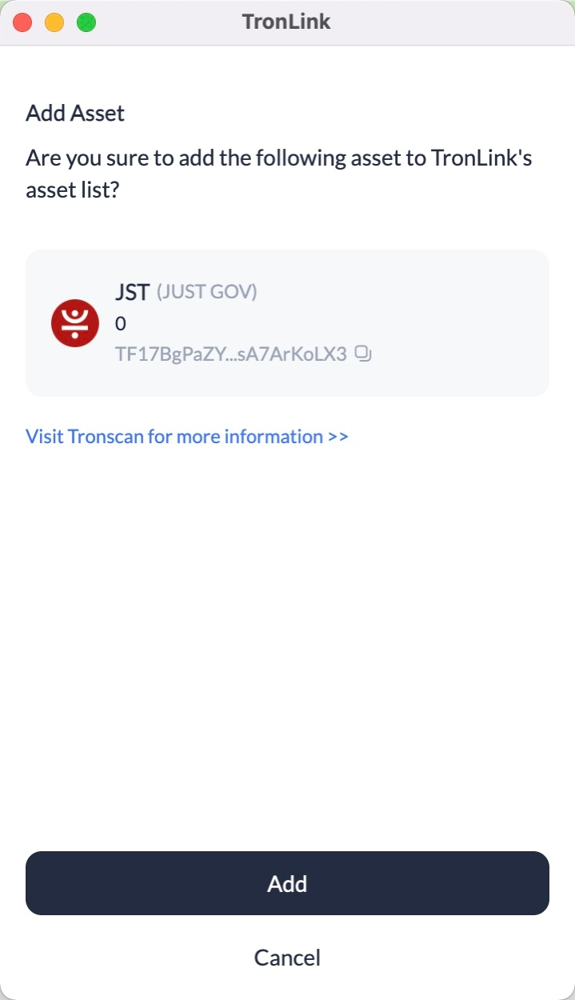
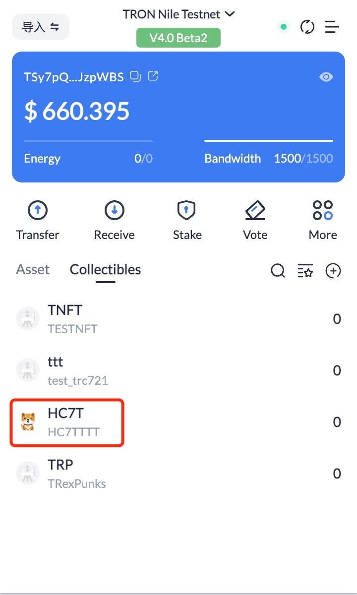

# Add Token

**Overview**

Buttons on DApps allow users to directly add the specified tokens to the asset list on their TronLink user extension.

**Specification**

**Example**

```shell
    const res = await tronWeb.request({
      method: 'wallet_watchAsset',
      params: {
        type: 'TRC20',
        options: {
          address: 'TR7NHqjeKQxGTCi8q8ZY4pL8otSzgjLj6t'
        }
      },
    });
```
**Parameters**

```shell 
    
    interface WatchAssetParams {
      type: 'trc10' | 'trc20' | 'trc721';
      options: {
        address: string;
        symbol?: string;
        decimals?: number;
        image?: string;
      }
    }
``` 
  * method: wallet_watchAsset fixed string

  * params: WatchAssetParams, the specific parameters are as follows:

    * type: Only 'trc10', 'trc20', 'trc721' are supported now

    * options:

        * address: the contract address of the token or the token id, required

        * symbol: placeholder (currently unused), optional

        * decimals: placeholder (currently unused), optional

        * image: placeholder (currently unused), optional


**Returns**

This method has no return value

**Interaction**

**Add TRC10 assets**

```shell
    
    if (window.tronLink.ready) {
      const tronweb = tronLink.tronWeb;
      try {
        tronweb.request({
          method: 'wallet_watchAsset',
          params: {
            type: 'trc10',
            options: {
              address: '1002000'
            },
          },
        });
      } catch (e) {}
    }
```

When the code is executed, a TronLink pop-up window for adding TRC10 assets will show up, and the user can click “Add” or “Cancel”. 


After clicking "Add", users can see the added assets as shown in the following screen:


**Add TRC20 assets**

```shell 
    
    if (window.tronLink.ready) {
      const tronweb = tronLink.tronWeb;
      try {
        tronweb.request({
          method: 'wallet_watchAsset',
          params: {
            type: 'trc20',
            options: {
              address: 'TF17BgPaZYbz8oxbjhriubPDsA7ArKoLX3'
            },
          },
        });
      } catch (e) {}
    }
```
When the code is executed, a TronLink pop-up window for adding TRC20 assets will show up, and the user can click “Add” or “Cancel”. 



After clicking “Add”, users can see the added assets as shown in the following screen: 


**Add TRC721 asset**

```shell
    if (window.tronLink.ready) {
      const tronweb = tronLink.tronWeb;
      try {
        tronweb.request({
          method: 'wallet_watchAsset',
          params: {
            type: 'trc721',
            options: {
              address: 'TVtaUnsgKXhTfqSFRnHCsSXzPiXmm53nZt'
            },
          },
        });
      } catch (e) {}
    }
```
When the code is executed, a TronLink pop-up window for adding TRC721 will show up, and the user can click “Add” or “Cancel”. 


After clicking “Add”, users can see the added assets as shown in the following screen: 


