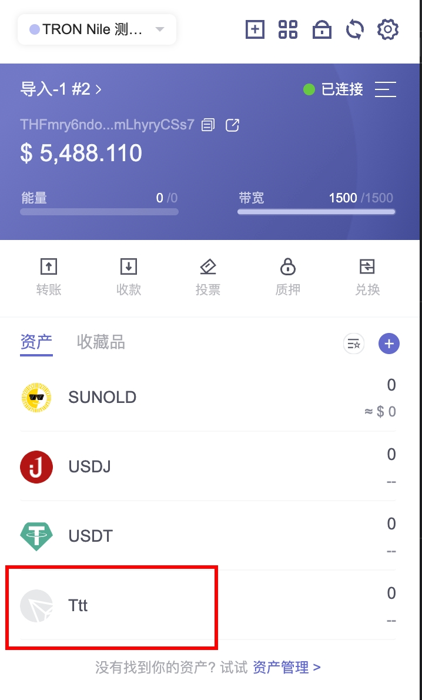
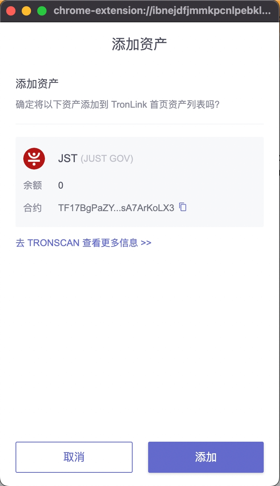
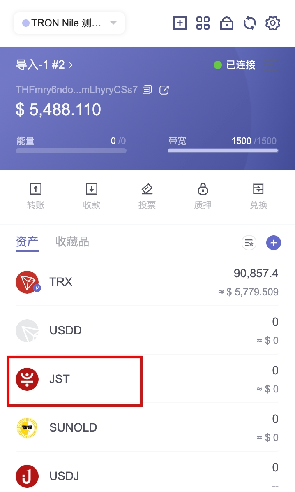

# 添加Token
**简介**

DApp 提供按钮给用户， 直接将指定的 Token 添加到用户插件的资产展示列表中。

**技术规范**

**代码示例**

```shell

    const res = await tronWeb.request({
      method: 'wallet_watchAsset',
      params: {
        type: 'TRC20',
        options: {
            address: 'TR7NHqjeKQxGTCi8q8ZY4pL8otSzgjLj6t'
        }
      },
    });
```
**参数**

```shell

    interface WatchAssetParams {
      type: 'trc10' | 'trc20' | 'trc721';
      options: {
        address: string;
        symbol?: string;
        decimals?: number;
        image?: string;
      }
    }
```
  * method: wallet_watchAsset 固定的字符串

  * params: WatchAssetParams，具体参数如下：

    * type: 目前只支持 'trc10', 'trc20', 'trc721' 三种

    * options:

        * address: token 的合约地址 或者 token id, 必传

        * symbol: 占位(目前未使用)，可选

        * decimals: 占位(目前未使用)，可选

        * image: 占位(目前未使用)，可选

**返回值**

此方法没有返回值

**交互流程**

**添加 TRC10 资产**

```shell

    if (window.tronLink.ready) {
      const tronweb = tronLink.tronWeb;
      try {
        tronweb.request({
          method: 'wallet_watchAsset',
          params: {
            type: 'trc10',
            options: {
              address: '1002000'
            },
          },
        });
      } catch (e) {}
    }
```
代码执行时，TronLink 会弹出添加窗口，用户点击确定添加 TRC10 资产，或者取消添加。


点击“添加”按钮，资产被添加到资产列表，如下图所示：




**添加 TRC20 资产**

```shell

    if (window.tronLink.ready) {
      const tronweb = tronLink.tronWeb;
      try {
        tronweb.request({
          method: 'wallet_watchAsset',
          params: {
            type: 'trc20',
            options: {
              address: 'TF17BgPaZYbz8oxbjhriubPDsA7ArKoLX3'
            },
          },
        });
      } catch (e) {}
    }
```
代码执行时，TronLink 会弹出添加窗口，用户点击确定添加 TRC20 资产，或者取消添加。




点击“添加”按钮，资产被添加到资产列表，如下图所示：




**添加 TRC721 资产**

```shell

    if (window.tronLink.ready) {
      const tronweb = tronLink.tronWeb;
      try {
        tronweb.request({
          method: 'wallet_watchAsset',
          params: {
            type: 'trc721',
            options: {
              address: 'TVtaUnsgKXhTfqSFRnHCsSXzPiXmm53nZt'
            },
          },
        });
      } catch (e) {}
    }
```
代码执行时，TronLink 会弹出添加窗口，用户点击确定添加 TRC721 资产，或者取消添加。


点击”添加”按钮，资产被添加到资产列表，如下图所示：


