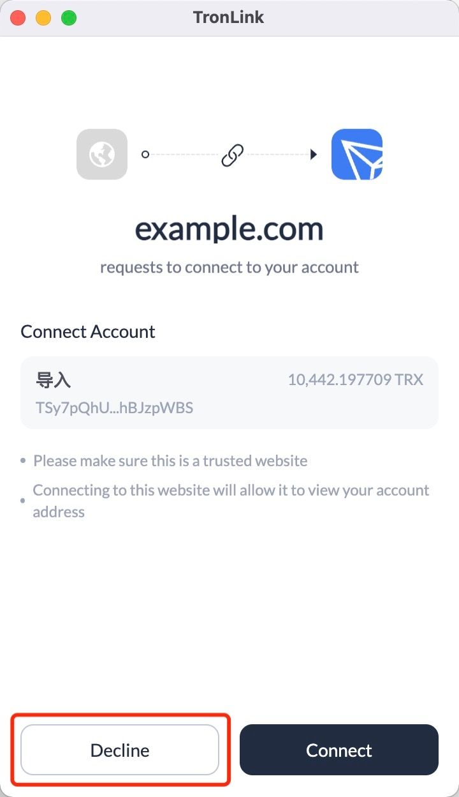

# User rejects connection

<span class="deprecated">DEPRECATED</span>

Message ID: `rejectWeb` 

This message is generated when:

  1. The DApp requests a connection and the user rejects the connection in the pop-up window. 
  
  


Developers can get the connection rejection message by listening to it:

```shell
    
    
    window.addEventListener('message', function (e) {
      if (e.data.message && e.data.message.action == "rejectWeb") {
        // handler logic
        console.log('got rejectWeb event', e.data)
      }
    })
```